# ChangeGuard architecture

## Recommendation

The original idea is useful, but a nightly AI test generator alone will create a larger suite without reliably preventing regressions. ChangeGuard uses a hybrid quality loop:

1. **PR-time prevention** runs the existing suite and generates change-focused boundary, contract, authorization, and failure-path tests before merge.
2. **Nightly test mining** revisits recently changed code and proposes additional tests when compute latency is less important.
3. **Evidence gates** reject unsafe, flaky, redundant, or weak candidates. A test is not promoted merely because a model wrote it.
4. **Reviewed corpus growth** promotes validated, test-only artifacts into the repository. Merged tests become part of every future PR and nightly run.
5. **Independent contracts** cover the seams most likely to break between frontend and backend: OpenAPI/GraphQL schemas, generated clients, database migrations, events, and consumer-driven contracts.

## End-to-end flow

```mermaid
flowchart LR
    A[Opted-in frontend and backend repos] -->|PR or daily schedule| B[Isolated CI runner]
    B --> C[Baseline suite]
    B --> D[Change and dependency impact map]
    D --> E[Secret redaction and context budget]
    E --> F[Structured test generation]
    F --> G[Path and side-effect policy]
    G --> H[Run full suite twice]
    H --> I{Useful and deterministic?}
    I -->|Yes| J[Reviewed test artifact]
    J --> K[Test-only PR]
    K -->|Merge| L[Cumulative corpus]
    L --> C
    I -->|Flaky or weak| M[Reject or quarantine]
    C -->|Existing failure| N[Breaking-change evidence]
    H -->|New test exposes defect| N
    N --> O[Authenticated event API]
    O --> P[(D1 run, test and alert history)]
    P --> Q[Dashboard]
    O --> R[Slack-compatible webhook]
```

## Components

| Component | Responsibility | Trust boundary |
| --- | --- | --- |
| Dashboard | Organization health, corpus growth, repository state, risk evidence, manual queueing | No source execution |
| Control-plane API | Stores run/test/alert events and optionally dispatches an explicitly configured runner | Authenticated ingestion token |
| Repository runner | Detects stack and recent changes, runs baseline, requests candidates, validates and packages results | Runs only inside the opted-in repository's isolated CI job |
| Generator adapter | Sends only bounded, redacted changed-file context and requires strict JSON-schema output | External model boundary; disabled without an API key |
| Acceptance gate | Safe path, no overwrite, changed-target check, assertion check, network/process denial, two complete passes, optional mutation command | Generated code is untrusted |
| Corpus promotion | Human-reviewed test-only change; repository branch protections remain authoritative | No automatic production-code changes |

## Frontend and backend test strategy

Use several test layers instead of asking the generator to create only unit tests:

- Frontend: pure component and state tests, accessibility checks, Playwright critical journeys, visual tests only for stable components.
- Backend: unit and property tests, authorization matrices, idempotency/retry cases, transaction boundaries, schema/migration checks, and failure injection.
- Across the seam: OpenAPI/GraphQL compatibility, generated-client drift, consumer-driven contracts, event-schema compatibility, and a small set of end-to-end journeys.
- For risky PRs: change-impact selection first, then the full protected suite before merge.

## Acceptance policy

A generated candidate can enter the reviewed artifact only when all of these hold:

- the path is under a configured test root and does not already exist;
- it targets a production file in the bounded change set;
- it contains a recognizable assertion and no direct network or child-process side effect;
- the current full suite passes before generation;
- the full suite passes twice with the candidate;
- when `require_validation` is enabled, the configured mutation/usefulness command succeeds;
- the final cumulative suite still passes.

If the baseline fails, or a sensible generated regression test fails on the current revision, ChangeGuard records a breaking-change alert with trimmed command evidence. Flaky candidates are rejected rather than retried until green.

## Security and operating model

- Repositories opt in individually. There is no default organization-wide clone or write permission.
- The runner sends only changed source files within byte/file budgets; common credential forms are redacted and sensitive paths are excluded.
- Generated tests never overwrite files and are removed from the checkout unless `--write-accepted` is explicitly set.
- Promotion remains a reviewable test-only action. Branch protection, CODEOWNERS, and normal CI checks still apply.
- Use short-lived GitHub App installation tokens for a production integration. Avoid organization-wide personal access tokens.
- Run untrusted candidates in ephemeral, network-restricted jobs with CPU, memory, and time limits.

## Production rollout

Start with two repositories for two weeks: one frontend and one backend. Run in report-only mode, tune commands and exclusions, measure flaky-candidate rate, mutation kills, escaped defects, runtime, and model cost. Then enable PR blocking only for baseline failures and reproducible generated regressions. Promote candidates through test-only review until precision is consistently high; expand repository opt-in after that.
